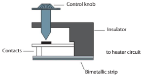
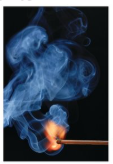

# Chapter 1: Temperature and Heat

## 1.1 Sensation of hotness and temperature

> [!IMPORTANT] Activity 1
> Place one hand in cold water and the other hand in hot water, for a couple of minutes.
> Take your hands out and place them in warm water. What will each hand feel?

Such experiences lead us to the following generalization:

**"Our sense of heat tells us whether heat energy is leaving our skin, the case in which we feel the sensation of coldness, or whether heat energy is entering our body through our skin, the case in which we feel the sensation of hotness".**

Is there such a thing as absolute hotness? If yes, our sensation of hotness, being relative, cannot determine that. Hence, instruments other than our sense of hotness are required. Scientists believe that there is an absolute measure of hotness that we call temperature.

**Temperature may be defined as the degree of hotness of a body, a property which can change and be measured.**

Scientists believe that physical changes always take place at the same temperature, anywhere in the universe, and at any time. For instance, under a pressure of $1$ atm, water boils at $100°C$ on the surface of the Earth.

Matter has properties that seem to change with hotness, like the volume of a fixed mass of gas at constant pressure, the length of a certain rod of steel, the length of a column of liquid inside a glass tube, etc.

**Thermometric properties are properties of objects that can be used to make thermometers, such as the change of volume of a fixed mass of gas at constant pressure. They are called thermometric properties because they can be used to measure temperature.**

Not any property that changes with temperature is a thermometric property. Thermometric properties have to be measurable, that is, they have to have different values at different temperatures, but the same value under the same conditions.

---
### Experiment

"Every time you place the same thermometer in melting ice, the liquid inside it will reach the same level".

Gather evidence to support this generalization by experiment and write up your results.

Give a full description of the equipment used, the procedures you followed, the precautions you took, the number of repetitions, etc.

Name TWO thermometric properties: \_\_\_\_\_\_\_\_\_\_\_\_\_\_\_\_\_\_\_\_\_\_\_\_

---

**Thermometers are instruments that utilize a particular thermometric property to measure temperature.** The mercury-in-glass, alcohol-in-glass, thermocouple and bimetallic strip thermometers are examples you will encounter in this course.

## 1.2 Temperature scale

**To measure temperature, a temperature scale and a unit are needed.** We will learn how to construct a Celsius scale of temperature. Specifically, we will use a mercury-in-glass thermometer to build our temperature scale.

*In these notes, we will use the term ice point to represent the point on the thermometer which corresponds to the tip of the mercury column when the thermometer is in thermal equilibrium with melting ice at a pressure of one atmosphere. On the Celsius scale, the temperature of the thermometer, when the mercury level is at this point, is defined to be $0°C$.*

*Similarly, the term steam point is used to represent the point on the thermometer which corresponds to the tip of the mercury column when the thermometer is in thermal equilibrium with the steam above boiling water at a pressure of one atmosphere (i.e. around $1.01 \times 10^5$ Pa). On the Celsius scale, the temperature of the thermometer when the mercury level is at this point, is defined as $100°C$.*

---
**Experiment:** Checking the *calibration of a Celsius thermometer.* This experiment is to be done in teams of two.

1.  Using the procedure shown in the first diagram above, mark the ice point on the thermometer.

2.  Set up the apparatus shown in the second diagram above. Once the water starts to boil, heat very gently.

3.  Ensure that the thermometer bulb is just above the surface of the boiling pure water. (If the thermometer is submerged in the water it will read the temperature of the water, which may be superheated, but if it remains just above it, it will read the temperature of the steam in equilibrium with the water.)

4.  Wait until the reading of the thermometer is constant, then note the reading in your lab book.

5.  Take the reading of the barometric pressure in the room.

6.  Answer the following questions, and include the answers in the report you hand in to your teacher (after completing the next section).

    (a) Why should there be a second hole in the cork?

    (b) Supposing that the reading of the barometer was $760$ mm Hg, and that your temperature reading was NOT $100°C$. What do you conclude?

    (c\) Supposing that the reading of the barometer was NOT $760$ mm Hg, and that your temperature reading was $100°C$. What do you conclude?

---

The above experiment is regarded as a tool to assess manipulative skills. It is an excellent example of the need for awareness of correct safety procedures when working in the laboratory. There are three principal hazards, of which you should be aware: (a) fragile glassware, (b) toxic mercury and (c\) extreme heat.

**(a) Fragile glassware:** The only way any glass can break during this experiment is if someone is careless. Always arrange your apparatus so that you know exactly where everything is. You can only mistakenly knock something over if you don't know where it (or what your colleagues) put it. Take personal mature responsibility for your own safety.

A common blunder is to snap a thermometer while trying to insert it into a hole that is too small. Most thermometers have rubber grommets to prevent them slipping, so you can afford to use a large hole in the bung. The jagged end of a glass thermometer is a lethal weapon. If it is unavoidable to insert the thermometer into a tight bung, wrap the hand holding the bung in a towel, twist slowly while pushing, and apply no lateral forces. "Bravery" in the face of this hazard can result in severe injuries and should be avoided. It is common sense, not cowardice, to inform yourself about all the dangers and to take steps to avoid them.

**(b) Mercury:** If you do break a thermometer, mercury will leak out. Report the spillage immediately to the laboratory supervisor (usually the teacher). The spilt mercury is mopped up by "flowers of sulphur" (ordinary sulphur powder), and the resulting sludge can be scraped up like any other spillage. Do not chase little droplets of mercury around the lab. Apart from this being undignified, ingested mercury (even in vapor form) is a cumulative poison which causes brain damage.

**(c\) Heat hazard:** The butane burner can cause serious burns, so you should (i) know where it is and (ii) turn it off and put it out of harm's way when not in use. Any suspected leak of gas should be reported to the laboratory supervisor. Steam can also give painful burns that can take a long time to heal. In this experiment, you should know that the flask itself is too hot to touch and the steam comes out of the right-angled glass tube at the top. So, don't touch them. Most serious burns are caused by involuntary muscle movements caused by minor burns (knocking over something very hot as a result of pulling a finger away from touching it accidentally). You can only accidentally touch something hot if either (i) you don't know it is hot, or (ii) you don't know where it is; both completely avoidable circumstances.

### The Celsius scale of Temperature

To calibrate the thermometer using the Celsius scale, proceed as follows:

1.  Measure the distance between the bottom end of the thermometer and the ice point. Call this length $l_0$.

2.  Measure the distance between the bottom end of the thermometer and the steam point. Call this length $l_{100}$.

3.  On graph paper, plot temperature in °C on the vertical axis, and length on the horizontal axis.

4.  Plot the two points ($l_0$, $0$) and ($l_{100}$, $100$) on the graph.

5.  Draw a straight line joining the two points above. By definition, the Celsius temperature scale is chosen to vary linearly with the thermometric property $l$.

6.  To determine the temperature of any object, insert the thermometer into the object and mark the position of the mercury. Measure the corresponding length $l$, and find the temperature from the graph.

7.  The "size" of a degree Celsius is $1/100$ of the temperature difference between the temperature of the ice point ($0°C$) and that of the steam point ($100°C$). The corresponding difference for the thermometric property is $1/100$ the distance between the ice-point and the steam-point. Show this on the graph, and hand in the lab report for checking.

Although the definition of the Celsius scale provides an objective and practical way of measuring the "hotness" of a body, it still suffers from its dependence on the thermometric agent used (mercury, alcohol, etc.). This is because different liquids (and solids) behave quite differently at different temperatures. Thus, if the readings of two liquid-in-glass thermometers (e.g. mercury and alcohol) are made to coincide at the ice and steam points, there is no guarantee they'll do so at any other temperature.

In contrast, all ideal gases behave in the same manner, and this makes them perfect candidates as thermometric agents for the definition of a physically meaningful temperature scale. But how do ideal gases respond to temperature changes?

Experiments with rarefied (low density) gases, whose behavior models that of ideal ones, show that *"for equal amounts of gas, the product of the pressure $p$ the gas exerts on the walls of the container by the volume $V$ of the latter is the same for all ideal gases at equal temperature $t$"* (i.e. at thermal equilibrium). This universal behavior of ideal gases is known as **Boyle's Law**.

## 1.3 Gas Laws

### 1.3.1 Boyle's Law: Compressing a gas at constant temperature

---
#### Experiment
The diagram below shows a device which gives a reading of both volume and pressure of a fixed mass of gas at a constant temperature.

An amount of air is trapped in a strong glass tube by a column of oil. The oil is originally placed inside a reservoir. The pressure can be altered by pumping air from a foot pump into the space above the oil reservoir. The pressure can be read directly by the Bourdon pressure gauge. The pressure read is the sum of the actual pressure of the air and the atmospheric pressure. When no air has been pumped, the gauge reads the atmospheric pressure, $p = 1.0 \times 10^5$ Pa.

**How to perform the experiment?**

*   Slowly increase the pressure of the air using the foot pump.

*   Read the pressure on the Bourdon gauge and the corresponding volume from the vertical volume scale.

*   Repeat the experiment for several values of $p$ and $V$.

*   Tabulate your results as shown below.

| $p$ (kPa) | $V$ (cm³) | $p \times V$ (MPa.cm³) | $1/p$ (1/MPa) |
| :--- | :--- | :--- | :--- |
|  | | | |
| | | | |
| | | | |
| | | | |
| | | | |

*   Notice that as the pressure increases the volume decreases.

*   Moreover the product $p \times V$ is almost a constant.

*   Draw a graph of $V$/cm³ vs $1/p$ (1/MPa)

#### Outcome of the experiment

*   The graph should be a straight line passing through the origin.

*   We can say that $V$ and $1/p$ are directly proportional or that $V$ and $p$ are inversely proportional.

*   The mathematical representation of Boyle's law is:
    $V \propto \frac{1}{p}$ or $V = \frac{constant}{p}$ or $pV = constant$ 

*   Boyle's Law is stated as follows
    **"For a fixed mass of gas at constant temperature the volume is inversely proportional to the pressure".**

*   Note: If $V$ vs $p$ is plotted, a curve like the one shown below is obtained.

---

### The Kelvin Scale

Boyle's law can be used to define the absolute temperature (or Kelvin) scale as follows

$pV = cT$

where $C$ is a constant (that depends on the amount of matter, i.e. the number of moles of the ideal gas) and $T$ is the *absolute temperature* measured in kelvin (K). The kelvin is defined in such a way as to make the absolute temperature difference between the steam and ice points agree with the corresponding Celsius difference, i.e. $T_{100} - T_0 = 100$ K. In other words the absolute temperature scale contains $100$ kelvin between the ice and steam points, and a change in temperature of $1$ K is identical to a $1°C$ change. On the other hand it is experimentally established that for a fixed amount of ideal gas the product $pV$ at steam point is $1.3661$ times its value at ice point, (i.e. $T_{100} = 1.3661T_0$). Solving the last two equations for $T_0$ we get $T_0 = 273.15$ K from which we readily deduce $T_{100} = 373.15$ K. **The relation between the absolute and the Celsius scales that satisfies the above two requirements is of the form**

$T = \theta + 273.15$,

where $\theta$ is the temperature in degrees Celsius. We note that it is correct to write "degrees Celsius" and "kelvin" (with a small "k" for the word written out or a capital for the abbreviation: $K$); but it is incorrect to refer to "Celsiuses" or "degrees Kelvin".

### Thermocouple

A thermocouple is a simple temperature sensor that consists of two dissimilar metallic wires, such as iron-constantan and copper-constantan. The wires are joined at two junctions so as to make a closed circuit. One junction, called the reference thermo-junction, is maintained at a fixed temperature and the other junction is used as a probe to measure the temperature of the desired body. When junctions have different temperatures, a weak thermoelectric current will flow in the circuit. This current can be detected by a galvanometer ($G$) (sensitive meter) whose reading is used to deduce the relative temperature of the probe junction.

Thermocouples have low heat capacity which makes them respond quickly to changes in temperature and quickly reach thermal equilibrium with the body. Moreover thermocouples are very sensitive over a wide range of temperatures ($4$ K to $2700$ K) with a relatively high precision (about $0.01$ K).

### 1.3.2 Charles' Law: The Expansion Law for constant Pressure

If the pressure of a fixed amount of ideal gas is maintained constant, then the relation between the three macroscopic parameters $p$, $V$, and $T$, becomes $V = kT$.

This can be stated as *"at constant pressure the volume of a fixed amount of gas is directly proportional to its absolute temperature"*.

This statement is known as **Charles' law**. It would be noted that the volume in this case becomes a thermometric quantity whose value can be used to judge the temperature of gas and any other body in thermal equilibrium with it.

### 1.3.3 The pressure Law: Heating a gas at constant Volume

"For a fixed amount of gas occupying a constant volume, the pressure is directly proportional to the absolute temperature" is the statement of the third gas law, known as the **Pressure Law**. The figure shows the graphical variation of pressure with temperature for a fixed amount of ideal gas of constant volume. In symbols, $p \propto kT$.

### 1.3.4 The gas equation

For ideal gases, the three equations between $p$, $V$, and $T$ can be combined together to give the gas equation
$\frac{pV}{T} = \text{constant}$ ($T$ in K).

When $p$, $V$, and $T$ all change from $p_1$, $V_1$, and $T_1$ to $p_2$, $V_2$, and $T_2$, then **$\frac{p_1V_1}{T_1} = \frac{p_2V_2}{T_2}$**.

When $T$ is constant the equation reduces to $pV = \text{constant}$ (Boyle's Law), or $p_1V_1 = p_2V_2$.

When $p$ is constant the equation reduces to $\frac{V}{T} = \text{constant}$ (Charles's Law), or $\frac{V_1}{T_1} = \frac{V_2}{T_2}$.

When $V$ is constant the equation reduces to $\frac{p}{T} = \text{constant}$ (Pressure Law), or $\frac{p_1}{T_1} = \frac{p_2}{T_2}$.

---

#### EXAMPLE 1.1

A foot air pump contains $100$ cm³ of air at $17°C$ and at $1.0$ atmosphere pressure. When air is compressed to $20$ cm³, its temperature rises to $27°C$. Determine its pressure then.

**SOLUTION**

Initial state: $p_1 = 1.0$ atm, $V_1 = 100$ cm³ and $T_1 = 17°C = (17 + 273)$ K $= 290$ K.

Final state: $p_2 = ?$, $V_2 = 20$ cm³ and $T_2 = 27°C = (27 + 273)$ K $= 300$ K.

Using $\frac{p_1V_1}{T_1} = \frac{p_2V_2}{T_2}$, we get $p_2 = p_1 \times \frac{V_1}{V_2} \times \frac{T_2}{T_1} = 1.0 \times \frac{100}{20} \times \frac{300}{290} \approx 5.2$ atm

---

## 1.4 Change in temperature using Kinetic Theory

When you studied the Kinetic Molecular Theory of Matter, you learned that the molecules of any object undergo random motion, such that each particle possesses some kinetic energy, even at very low temperatures. The average kinetic energy $\overline{E}$ of the molecules of an object is directly proportional to the absolute temperature $T$ of the object, that is $\overline{E} = kT$.

This is the fundamental relation we sought between the temperature as a macroscopic quantity and the microscopic properties of matter. Thus, normally, **if energy is added to an object such that the average kinetic energy of its molecules increases, its temperature increases.**

## 1.5 Thermal properties of matter

**Heat is internal energy, but temperature is a measure of the average kinetic energy due to the random motion of the molecules of an object.**

Heat energy is the kind of energy, which when added to an object, normally results in an increase in the kinetic energy of the molecules (the concentration of energy in the object increases). The total energy added to the body is measured in joules. This causes an increase in the average kinetic energy per molecule, which on the macroscopic scale manifests itself as an increase in temperature, measured in kelvins or degrees Celsius. The higher the temperature of an object, the more the random thermal energy of its particles (on average).

**Heat energy is needed to raise the temperature of a body.**

> The relationship of "heat energy" to "temperature" is the same as the relationship of "money" to "wealth". If you give some money to a group of persons their wealth increases. Similarly, if you give heat to matter, its temperature will increase.

### 1.5.1 Specific heat

**The energy required to raise the temperature of one kilogram of a substance by 1 degree Celsius is called the specific heat capacity denoted by $c$**. Its unit is $J \cdot kg^{-1} \cdot °C^{-1}$ or $J \cdot kg^{-1} \cdot K^{-1}$. It follows that the quantity $Q$ of energy required to raise the temperature of $m$ kg of a substance by $\Delta T$ kelvin (or °C) is

**$Q = mc\Delta T$**

The following table lists the specific heat capacities of some substances:

| Substance | $c$ ($J \cdot kg^{-1} \cdot K^{-1}$) |
| :--- | :--- |
| Water | 4.2 |
| Ice | 2.1 |
| Iron | 0.48 |
| Copper | 0.39 |
| Aluminum | 0.90 |
| Silver | 0.25 |
*Approximate specific heat capacity*

---
#### EXAMPLE 1.2

If the specific heat capacity of water is $4.2 \times 10^3 J \cdot kg^{-1} \cdot K^{-1}$, calculate the amount of energy needed to raise the temperature of $10.00$ kg of water from $312$ K to $322$ K.

**SOLUTION**

The change in temperature is $\Delta T = 10$ K and the amount of heat required is
$Q = 10.00 \times 4.2 \times 10^3 \times 10 = 4.2 \times 10^5$ J.

---

#### EXAMPLE 1.3

Calculate the change in temperature of a $50$ g silver spoon that loses $500$ J of thermal energy to the surroundings.

**SOLUTION**

$\Delta T = \frac{Q}{mc} = \frac{-500}{0.05 \times (0.25 \times 10^3)} = -40$ K

---

#### EXAMPLE 1.4

The heat capacity $C$ of an object (or system of objects) is the energy needed to raise its temperature by $1$ K. Calculate the heat capacity of $3$ kg of water.

**SOLUTION**

To raise the temperature of $1$ kg of water by $1$ K we need $c$ joules, for $3.0$ kg we shall need
$C = (3.0 \text{ kg}) c = 3.0 \times 4.2 \times 10^3 J K^{-1}$. Generally, the relation between $c$ and $C$ is $C = mc$, where $m$ is the mass of the object.

---

#### EXAMPLE 1.5

$5$ kg of hot water at $\theta_1 = 75°C$ are mixed with $15$ kg of cold water at $\theta_2 = 10°C$. Determine the temperature $\theta$ of water at thermal equilibrium. Neglect energy losses to the container and surroundings.

**SOLUTION**

Let's denote by $Q_1$ and $Q_2$ the quantities of heat lost by the hot water and gained by the cold water, respectively (recall that spontaneous heat transfer occurs from hot to cold bodies).

We have $Q_1 = m_1c(75 - \theta)$ and $Q_2 = m_2c(\theta - 10)$ where $m_1 = 5$ kg and $m_2 = 15$ are the masses of hot and cold water, respectively. On the other hand, the law of conservation of energy requires the equality $Q_1 = Q_2$, which after substitution from above yields $m_1c(75 - \theta) = m_2c(\theta - 10)$ or equivalently $5(75 - \theta) = 15(\theta - 10)$.

Solving for $\theta$, we get $\theta = 26.25°C$.

---
### Experiment

#### Procedure

*   Use $1$ kg samples in the form of cylindrical blocks (e.g., copper, aluminum, and water in a beaker).

*   The copper and aluminum blocks should have two holes drilled in them, so that the immersion heater and the thermometer can be placed inside each hole.

*   Place the immersion heater in the central hole and the thermometer in the other hole.

*   Add a few drops of lubricating oil to improve the heat transfer from the heater to the block.

*   Add a few drops of oil in the thermometer hole in order to insure a good thermal contact.

*   Read the initial temperature of the copper block and record it.

*   Connect a $12$ V, $50$ W immersion heater to a low voltage power pack set at $12$ V.

*   Switch on the power pack and measure the time taken for a temperature rise of $10$ K or $10°C$.

*   Repeat the experiment for the $1$ kg aluminum block.

*   Repeat also the experiment for the beaker containing $1$ kg of water.

#### Outcome of Experiment

*   Different materials need different times to warm up by $10$ K.

*   Different materials have different heat capacities.

*   The heat capacity of a substance depends on what it is made of.

*   Approximate times needed to raise the temperature of $1$ kg of each sample by $10°C$: $1.5$ minutes for copper, $3$ minutes for aluminum and $15$ minutes for water.

*   Hence, the order of heat capacities from lowest to highest: copper, aluminum and water.

**The heat capacity of an object depends on its material.**

---

### 1.5.2 Measuring specific heat

**The specific heat capacity of a substance can be measured using one of the experiments explained in the following section.**

---
#### Experiment 1: Using an ammeter and a voltmeter

*   Get a $12$ V DC power pack and connect a $12$ V immersion heater to it, as shown in the diagram below.

*   Using a scale, find the mass $m$ of the substance (either solid or liquid).

*   Use an insulating material called lagging to wrap the metal block or beaker.

*   If you are using a beaker, cover the beaker with a lid.

*   Record the initial temperature ($T_1$) before switching the heater on.

*   Switch on the heater and simultaneously start the stopwatch.

*   Record the value of the current $I$ on the ammeter and record the value of the voltage $V$ on the voltmeter.

*   When the temperature increases by $10°C$, turn off the heater, stop the stopwatch directly, and record the time.

*   Record the highest temperature reached ($T_2$) after switching off the heater.

*   Calculate the rise in temperature using the equation: $\Delta T = T_2 - T_1$

*   Calculate the energy supplied by using the equation: $Q = IVt$

*   Calculate the specific heat capacity using the equation: $c = \frac{Q}{m\Delta T}$

> 1. If the substance is water, the value of $c$ should be around $4200 J kg^{-1} K^{-1}$.
> 2. If the substance is aluminum, the value of $c$ should be around $880 J kg^{-1} K^{-1}$.

---

#### Experiment 2: Using a joulemeter

*   Get a $12$ V DC power pack and connect a $12$ V immersion heater to it, as shown in the diagram below.

*   Using a balance, find the mass $m$ of the substance (either solid or liquid).

*   Use an insulating material called lagging to wrap the metal block or beaker.

*   If you are using a beaker, cover the beaker with a lid.

*   Record the initial temperature ($T_1$) before switching the heater on.

*   Record the initial reading on the joulemeter.

*   Switch on the heater.

*   When the temperature increases by $10°C$, turn off the heater.

*   Record the final reading on the joulemeter.

*   Record the highest temperature reached ($T_2$) after switching off the heater.

*   Calculate the rise in temperature using the equation: $\Delta T = T_2 - T_1$

*   Calculate the energy supplied by subtracting the two readings on the joulemeter.

*   Calculate the specific heat capacity using the equation: $c = \frac{Q}{m\Delta T}$

### 1.5.3 Change of state - specific latent heat

In a simple home experiment, immerse a thermometer in a can containing crushed ice, and watch its reading as the ice starts melting. You should notice that the reading of the thermometer becomes constant until all the ice melts, then it starts rising. If you repeat the same experiment with boiling water, you will observe that its temperature remains constant although heat is continuously provided to boiling water.

Where does heat energy supplied to water or to ice go?

You will recall from the Molecular Kinetic Theory that when thermal (heat) energy is added to a quantity of matter at its boiling point or at its melting point, a change of state occurs, without a change in temperature. All thermal energy given to a liquid at its boiling point goes to evaporate more liquid, without increasing the temperature of the liquid. According to the kinetic molecular theory, the added energy is not used to increase the kinetic energy of the molecules, but to increase the potential energy of some molecules anywhere in the liquid (not just on the surface), causing them to leave the liquid state and join the gaseous state. Energy is needed to pull liquid molecules away from other liquid molecules, against the forces that bind them together. Similarly, energy given to a solid at its melting point is all used to increase the potential energy of the molecules that break away from the solid state, and join the liquid state. **The heat added to a material to change its state is called *latent heat*, which means 'hidden heat'.**

**When thermal energy is added to a quantity of matter at its boiling point or at its melting point, a change of state occurs; solid changes to liquid and liquid changes to gas. Conversely, when thermal energy is removed from a quantity of matter at its boiling point or at its melting point, a change of state occurs, without a change in temperature; liquid changes to solid, and gas changes to liquid.**

**The sum of the random kinetic energies of all the particles of a body, plus the sum of potential energies in these particles is called **internal energy**.**

> [!NOTE]
> You should be able to explain which burns may hurt more: boiling water at $100°C$, or water vapor at $100°C$.*

> [!IMPORTANT] Activity 1
>
> The graph shows a plot of temperature (vertical axis) vs time of heating a solid at a constant rate. Explain its shape.
>
> 

> [!IMPORTANT] Activity 2
>
> If $1.00$ g of ice requires $335$ J to change it from ice at $273$ K to liquid water at $273$ K, how many kJ are required to melt $10$ kg of ice at $0°C$?
>
> How many joules are needed to melt $1$ kg of ice under these conditions?

The quantity found in the above activity is called the **specific latent heat of fusion** $l_f$ of water. Notice that by simple proportionality the heat needed to melt a mass $m$ kg of ice under these conditions is given by:
$Q = ml_f$

> [!IMPORTANT] Activity 3
>
> If $1.00$ g of water requires $2.26$ kJ to change it from water at $373$ K to steam at $373$ K, what is the change (specify it as an increase or decrease) in internal energy when $1.0$ kg of gaseous water at $100°C$ changes to liquid water at the same temperature? What is the total change in the kinetic energy of the molecules of water? What is the total change in their potential energy?
>
> How many joules are needed to boil $1$ kg of water under these conditions?

The quantity found in the above activity is called the **specific latent heat of vaporization** $l_v$ of water. Notice that by simple proportionality the heat needed to boil a mass $m$ kg of water under these conditions is given by
$Q = ml_v$

The following tables give the specific latent heats for some substances

**Table 1: Approximate specific heats of fusion**

| Substance | $l_f$ (kJ kg⁻¹) |
| :--- | :--- |
| Ice | 340 |
| Iron | 270 |
| Copper | 210 |
| Aluminum | 390 |
| Silver | 100 |

**Table 2: Approximate specific heats of vaporization**

| Substance | $l_v$ (MJ kg⁻¹) |
| :--- | :--- |
| Water | 2.3 |
| Mercury | 0.3 |

---
#### EXAMPLE 1.6

Two liquids $L_1$ and $L_2$ of the same mass are heated using identical heaters under equal conditions. The graphs depict the variation of temperature with time for the two liquids. Compare the liquids' boiling temperatures as well as their specific latent heats of vaporization.

**SOLUTION**

The horizontal section of each graph corresponds to a vaporization which for $L_1$ takes place at a higher temperature. Moreover, this horizontal section is longer for $L_2$, which means that more time is required to evaporate it, and thus more heat (heaters are identical.) Since the liquids have equal masses if follows that $L_2$ has the greater specific heat of vaporization.

---

#### EXAMPLE 1.7

Calculate the time required to vaporize $0.50$ kg of water (at $100°C$) with a $1.5$ kW electric heater. Neglect heat losses.

**SOLUTION**

The quantity of heat required is $Q = ml_v = 1.15$ MJ. This energy is delivered by the heater in a time $t = \frac{1.15 \times 10^6}{1.5 \times 10^3} = 7.7 \times 10^2$ s

---

#### EXAMPLE 1.8

The energy released in the condensation of $2.0$ g of steam (at $100°C$) into liquid water is used to melt ice (at $0°C$). Calculate the mass $m$ of ice that melts.

**SOLUTION**

The heat released by steam is $Q = ml_v = 4.6$ kJ.

The mass of molten ice is then $m = \frac{Q}{l_f} = \frac{4.6}{340} = 14$ g.

---

#### EXAMPLE 1.9

An ice cube of mass $50.0$ g at $0°C$ is submerged in $500$ g of water at $25°C$. Knowing that the ice cube melts entirely, calculate the temperature $\theta$ of water at thermal equilibrium.

**SOLUTION**

Let us denote by $Q_1$ the heat lost by the $0.50$ kg of water as its temperature decreases from $25°C$ to $\theta$, and by $Q_2$ the heat required to melt the ice cube and raise its temperature (from $0°C$ ) to $\theta$.

For $Q_1$ and $Q_2$ we have $Q_1 = 0.5c (25 - \theta)$ and $Q_2 = 0.05 l_f + 0.05 c \theta$, where $c$ is the specific heat capacity of water. Conservation of energy requires $Q_1 = Q_2$ from which we deduce that $0.55c\theta = 12.5c - 0.05l_f$. Solving the last equation for $\theta$ we get $\theta = 22.7 - 0.091\frac{l_f}{c} \approx 15.4$ °C.

---

#### 1.5.4 Measuring the specific latent heat of fusion of water

*   Connect the electric heater to its power supply and measuring circuit.

*   Put ice of known mass $m$ at $0°C$ into a thermo flask containing water at $0°C$ and upon heating keep stirring the mixture.

*   Turn on the stopwatch when heating starts.

*   Record the values of the current $I$ and the voltage $V$.

*   Once the ice has just melted, turn the heater and the stopwatch off, and record the time $t$. If it took, the heat energy supplied by the heater is $Q = IVt$.

*   Use the equation $l_f = \frac{Q}{m} = \frac{IVt}{m}$ to calculate the latent heat of fusion, where
    $m$ = mass of ice
    $t$ = time of heating
    $I$ = current read from the ammeter
    $V$ = voltage read from the voltmeter

#### 1.5.5 Measuring the specific latent heat of vaporization of water

The apparatus shown in the figure above gives an estimate of the specific latent heat of vaporization of water.

*   Connect an electric immersion heater to its power supply and measuring circuit

*   Fill a beaker with hot water, and cover it with a lid.

*   Weigh water + beaker + lid; let $m_1$ be the total mass.

*   Insert the heater through the hole in the lid.

*   Heat the water until it just begins to boil and remove the lid to allow steam to escape.

*   At the same time read the joulemeter (page 21), or start the clock and read the ammeter and the voltmeter (page 20).

*   After $15$ minutes switch off the heater and replace the lid.

*   Take a second reading of the joulemeter or stop the clock and record the time of heating.

*   Remove the heater and lagging, and weigh again water + beaker + lid, let $m_2$ be the new mass.

*   Mass of water converted into steam: $m = m_1 - m_2$; $t$: time of heating, $P$: current reading from ammeter, $V$: voltage reading from voltmeter.

*   $Q = IVt$ (or $Q$ is the difference of the two readings if a joulemeter is used)

*   $Q = ml_v$, so $l_v = Q/m$

#### 1.5.6 Evaporation

A liquid (or even a solid) evaporates not only at its boiling point, but at any temperature. The difference is that the boiling point evaporation takes place anywhere within the body of the liquid, whereas lower temperature evaporation takes place only at the surface. Evaporation is always accompanied by cooling. According to the kinetic-molecular theory, the potential energy of the particles that leave the liquid increases; this happens at the expense of the molecules that stay in the liquid state. Only the more energetic molecules near the surface leave the liquid; the remaining molecules will have a lower average kinetic energy, and therefore a lower temperature. This explains why when water evaporates from a porous pot the remaining water cools down. It also explains why when water evaporates from our skin we feel colder.

**Evaporation takes place at any temperature, and it causes cooling.**

## 1.6 Expansion of solids and liquids upon heating

Solids and liquids expand upon heating. This generalization has always been found to be true, although the expansion is relatively very small. You can strengthen your belief in the above generalization by trying out the demonstrations illustrated below.

The linear expansion of a solid under small variations in temperature can be well approximated by the formula
**$\Delta L = \alpha L_0 \Delta T$**
where $L_0$ is the linear dimension (length) at $T_0$, $\Delta T = T_f - T_0$ and $\Delta L = L_f - L_0$ are the changes in temperature (in kelvins or degrees Celsius) and any linear dimension of the body, and $\alpha$ is the **coefficient of thermal linear expansion** measured in $K^{-1}$ or $°C^{-1}$.

| Substance | $\alpha$ ($10^{-6} K^{-1}$) |
| :--- | :--- |
| Iron | 12 |
| Copper | 17 |
| Aluminum | 24 |
| Silver | 18 |

---

#### EXAMPLE 1.10

a) Calculate the change in length of a $40$ cm (at $0°C$) copper rod when it is heated from $0°C$ to $20°C$.

b) Due to a drop in temperature between day and night, the length of an iron beam varies by $1.2$ mm from day to night. If the change in temperature is $10°C$, what is the length of the beam?

**SOLUTION**

a) $\Delta L = \alpha L_0 \Delta T = 0.14$ mm.

b) Substituting in $\Delta L = \alpha L_0 \Delta T$ gives ($-1.2 \times 10^{-3}) = (12 \times 10^{-6}) \times L_0 \times (-10)$. Hence $L_0 = 10$ m. (The negative sign in $\Delta l$ and $\Delta T$ represent a decrease in length and temperature).

---

### 1.6.1 Expansion in all dimensions

The expansion of solids takes place in all dimensions. Thus, a brass circular plate and a brass spherical ball, each $1$ cm in diameter, will increase in diameter by $1.9$ cm for one degree rise in temperature. All linear dimensions will increase by the same factor. Furthermore, holes inside solids expand at the same rate as the solid. So, a brass circular ring and a brass spherical shell, each $1$ cm in diameter, will increase in diameter by $1.9$ cm for one degree rise in temperature. All linear dimensions will increase by the same factor, whether internal or external dimensions. This is verified by the ring and ball demonstration in the diagram above. Do not be fooled into believing that the expansion will push matter to partially fill up the holes - it doesn't happen that way!

-----
#### EXAMPLE 1.11

The area of an iron square plate at $25°C$ is $A_0 = 1$ m². Calculate the change in its area as it cools to $0°C$.

**SOLUTION**

Each side of the plate shrinks to $l = l_0(1 + \alpha\Delta T)$, where $l_0 = 1$ m is the side at $25°C$. So, the area becomes $A = l^2 = l_0^2(1 + \alpha\Delta T)^2 = A_0(1 + 2\alpha\Delta T + \alpha^2\Delta T^2)$. In the last expression $\alpha^2$ is a very small number and the term containing it can be safely neglected yielding $A - A_0(1 + 2\alpha\Delta T)$. Substituting the given values we get for the change in area $\Delta A = A - A_0 = A_0(2\alpha\Delta T)$ cm². Notice that the coefficient of surface expansion is $2\alpha$.

----
#### EXAMPLE 1.12

The inner radius of an aluminum ring measures $10.00$ cm at $25°C$. To what minimum temperature must the ring be heated for a steel ball of radius $10.01$ cm to slip through it?

**SOLUTION**

The change in radius $\Delta r$ must be greater than $0.1$ mm. Accordingly, the least change in temperature is $\Delta T = \Delta r / (\alpha r_0) = 41.67°C$, and the temperature must be raised to at least $66.67°C$.

-----
#### EXAMPLE 1.13

Consider the ring shown in the adjacent figure. What happens to the gap upon heating the ring?

**SOLUTION**

The size of the gap, as any other linear dimension, increases.

-----

**Application (Thermometers) :** Liquid in glass, clinical and bimetallic coil are common types of thermometers that operate using expansion of liquids and solids.

The liquid (mercury or alcohol) expands more than the cavity inside the glass. Because mercury boils at high temperatures, the mercury-in-glass is more suitable for higher temperatures. The alcohol-in-glass thermometer is more suitable for lower temperatures because alcohol freezes at a much lower temperature than mercury.

#### 1.6.2 Differential Expansion

When different solids stack together, or different parts of the same solid, expand by different amounts, bending or breaking can take place. If two different parts of the same material are heated by different amounts they will expand differently. When hot water is poured into a glass container, for example, the inner parts of the container suddenly become much hotter than the outer parts, therefore the inner part expands suddenly thus expanding more than the outer ones, possibly causing the container to break. Hence, **differential expansion of different solids or parts can cause distortion**.

Bimetallic Strip: If two different metal strips are stack together, forming the so called **bimetallic strip**, and heated to the same higher temperature, the strips will bend in the direction of the strip that expands least. This is because the outer strip must be longer than the inner one. For the same reason, if the strip is cooled below its normal temperature it bends toward the metal which contracts most.

##### Applications of Bimetallic Strips

Bimetallic strips are used in thermostats, electric breakers, and in many other mechanical switching circuits.

(a) Bimetallic strips are used in thermostats to keep the temperature of a room constant. The next figure shows the thermostat of an iron.

(b) A bimetallic strip can be used as a fire alarm, where heat from a fire makes it expand and bend so completing an electric circuit and causing an alarm bell to ring.

(c\) A bimetallic coil is used in thermometers fixed to some home ovens. Although it is not as accurate as mercury-in glass thermometers, this is not a problem, because high accuracy is not needed for cooking. The bimetallic coil is fixed at one end on the glass of the oven door, and a pointer is fixed on the other end. Changes in the temperature cause the pointer to move against a dial.

> *The above technique is being replaced by electronic circuits that use semiconductor based sensors with no moving parts*

#### 1.6.3 Forces resulting from expansion and contraction

Expansion and contraction can produce significant forces. In the coming experiments, we demonstrate that **large forces can be produced by small expansions or contractions**.

---
##### Experiment 1 Testing the force of expansion

*   Fit a tensioning nut and a cast iron bar in what we call a bar breaking apparatus as shown in the diagram below. Make sure that they are both positioned from inside at A and A'.

*   Twist the tensioning nut very well and secure the cast iron bar so that there is no place for expansion at all.

*   Use two Bunsen burners to heat the steel rod.

*   When the steel rod gets hot it should expand, since there is no room for expansion the cast iron bar will break.

##### Outcome of experiment

*   Although the cast iron bar is brittle it requires a large force to break it.

*   When metals like steel expand they produce a large force.

*   When a solid has no room to expand, its molecules produce a force of expansion by trying to make more space between themselves.

> *Since the rod-up is made of steel, this experiment takes time and requires a lot of heat to be supplied to the rod-provided.*

---

---
##### Experiment 2 Testing the force of contraction

*   Fit the tensioning nut and the cast iron bar from outside now at B and B'.

*   Heat the steel rod and tighten the tension nut while the Bunsen burner is still on.

*   When there is no room for contraction remove the heat and watch the cast iron bar.

##### Outcome of experiment

*   When a hot solid cools down, but is not allowed to shrink, its molecules pull on their neighbors producing a tension in the material, which is the force of contraction.

---

##### Precautions

The expansion of a short length of metal is too small to be noticed. However, the expansion of steel or a concrete bridge in summer can be great. Every $100$ m of steel will increase in length by around $5$ cm during a hot day.

Lots of precautions are taken for these temperature changes, some of which are:

(a) Concrete sleepers which can withstand large forces caused by temperature changes are used in this case. Similarly, tapered joints are used at the end of welded tracks.

(b) Some lengths of tracks are heated when they are welded together which leaves the track in tension when it cools down.

(c\) Pipelines in chemical industry must have flexible joints built in them at regular intervals.

##### Applications and Benefits

(a) Expansion and contraction are used in riveting to get a tight joint.

(b) They are also used to fit steel tires tightly onto cart wheels.

**Question:** Sections of bridges are supported on rollers and have small gaps between them. Choose the correct reason. The purpose of the rollers and gaps is to allow (a) rain water to drain away, (b) for expansion of the bridge sections when the temperature changes, (c\) for vibrations of the bridge due to the effects of the wind, (d) for force changes on the bridge as heavy lorries drive across.

## 1.7 Heat transfer by conduction

When two bodies are in thermal contact, thermal energy always goes from the body in which it is more concentrated (i.e. the hotter body) to the body in which it is less concentrated (i.e. the colder body). Scientists have experienced facts consistent with this generalization so frequently and with no exception, that it is now called a "law", stated as such:

**Heat flows spontaneously (by itself) from hotter to colder bodies, never the other way round.**

Furthermore, thermal energy continues to transfer from the hotter body to the colder body until it has the same concentrations in both bodies; they acquire the same temperature. When this happens, the two bodies are said to be in **thermal equilibrium**. When an isolated system contains bodies that are kept in contact with each other for a sufficiently long time they reach thermal equilibrium (they get the same temperature). This is the main postulate of thermal physics and it proves essential to thermometry, otherwise, the reading of a thermometer couldn't be attributed to the temperature of the body in contact with it.

> **Thermal equilibrium**

### 1.7.1 Conduction of Heat

If one end of a copper rod is placed in a flame, thermal energy travels along the solid from the region where it is concentrated (i.e. in the flame) to the regions where it is dilute (i.e. the other end). So, we say that heat is being conducted from the hotter to the colder region. **Conduction is the flow of heat along matter without any flow of matter.** For heat to flow by conduction from one part of matter to another, the parts have to be in contact.

We explain the flow of heat by means of the kinetic molecular theory by imagining that the faster-moving molecules in the hotter parts of matter collide with the slower moving molecules in the colder parts in contact with them, thus, passing on to them a part of their kinetic energy. **Therefore, kinetic energy travels across from molecule to molecule.**

The accepted model of a metal is that a metallic object consists of atoms with many free electrons. These **free electrons** are not confined to any particular place, but are free to **move throughout the body of the metal**. If a part of a metallic object is hotter than another, free-moving fast electrons move across the body of the metal, and thus carry thermal energy across the body, much faster than it can be transferred from molecule to molecule by molecular collision. Therefore, **metals are better conductors than non-metallic solids**. For instance, silver and copper being the best electric conductors are also the best conductors of thermal energy. On the other hand, water, glass, air, plastic and wood are poor conductors of heat; **poor conductors of heat are called insulators**.

> **Conductors and Insulators**

The next experiments illustrate conduction of heat in metals, water and air.

---
#### Experiment 1 Conduction of heat in metals

*   Place rods of different materials on top of a tripod as shown in the diagram (use rods of copper, steel and fiberglass).

*   Make sure that the rods are of the same length and diameter to provide a proper comparison among them.

*   Using wax, attach at the ends of the rods a small cork.

*   Heat the other end of the rod using a Bunsen burner.

*   Carefully take a look at what is going to happen to the corks at the other ends.

##### Outcome of Experiment

*   Heat flows along the rods at different rates and the cork drops off after a certain period of time.

*   The cork will drop off from the copper rod first, then the steel one, which will be followed by the fiberglass one at the end, because copper is a better conductor of heat than steel which in turn is better than fiberglass.

*   All metals are very good conductors of heat compared with other materials.

---

#### Experiment 2 Conduction of heat in water

*   Place a piece of ice at the bottom of a test tube as shown in the diagram.

*   Fill the test tube with cold water but not to the top.

*   Place a metal gauze to stop the ice from floating to the top surface.

*   Heat the top of the test tube using a Bunsen burner flame.

*   Take a look very carefully at what is going to happen.

##### Outcome of Experiment

*   Slow conduction of heat will take place through the water and the walls of the glass tube, the water at the top of the tube will start to boil first while the ice remains unmelted for a short period of time.

*   Liquids, with the exception of mercury, are bad conductors of heat.
**Water is a poor conductor of heat.**

---

#### Comparison of heat conduction in solids, liquids, and air

Warm clothes usually contain lots of trapped air. Between fibers of woolen materials there are a lot of what we call pockets of air, which can trap air easily and keep body temperature in. Insulators are materials that can trap large amounts of air. Examples are fiberglass and expanded polystyrene.

**Air is a very poor conductor of heat because it is a gas and in gases the molecules are very far apart. Due to this reason, air becomes a very important and good insulator.**

Although conduction can occur in all forms of matter, it is fastest in solids because the particles are closest together. As we mentioned earlier, in metals, heat conduction is much faster than in other solids due to conduction electrons. In liquids, conduction is slower than in solids due to the fact that the molecules are slightly farther apart (an exception is liquid mercury and molten metals, which are good conductors of thermal energy, because they are metals). However, the main way in which thermal energy is transferred in liquids is not conduction, but convection. This phenomenon is explained in the following sections. In gases, conduction is extremely poor because of the very large average distance between particles. In gases heat is transferred mostly by convection. Vacuum, having no matter in it, does not "conduct" thermal energy (however, we know that all radiant energy passes through vacuum at the speed of light).

## 1.8 Convection

In fluids (gases and liquids), heat transfers partly by conduction, but **more importantly by a natural "stirring" phenomenon called convection**. For example, see below how a boiled egg cools and how a match burns air. Convection occurs only in fluids (not in solids). It works as follows:

When a quantity of fluid is heated, its volume increases. Its mass, however, remains constant, **hence, its density decreases**. Due to gravity, all objects "compete" in coming closer to the Earth's center. The result is that denser objects "win", and sink nearer to the earth.

There are very few exceptions to this rule. The most important one is water between the temperatures of $0°C$ and $4°C$.

On the other hand, objects less dense than air, like hot air balloons, or bodies of hot air, float above the denser cold air. In terms of pressure, an object in a fluid experiences an upthrust which is less than its weight if it is denser than the fluid, and greater than its weight if it is less dense than the fluid. Thus, objects less dense than the body of the fluid **experience a net upward force, and will accelerate upwards**. When a part of a fluid is heated it becomes less dense, so it tends to move upward. Other denser parts sink, thus moving downwards. The result is that upward, downward and lateral currents of fluid movement (called **convection currents**) are created.

##### Convection in daily activities

A burning matchstick, for example, quickly uses up the oxygen in contact with the flame, and replaces it with carbon dioxide. But, although carbon dioxide is normally denser than air and should go down, it is actually very hot and is much lighter than air. So it floats upwards, together with the other hot gases, which are replaced by oxygen-rich cold air coming up from underneath the rising hot gases. An upward current of warmed gases (called a *thermal*) is generated (that can cause a toy pinwheel placed above the burning matchstick to rotate).

**Without gravity the match stick cannot keep on burning.**

Similarly, a hot boiled egg is also cooled by "gravity". Air in contact with the surface of the egg takes away some of its thermal energy by conduction. The heated air that rises by convection, is replaced by more cold air which cools the egg further by conduction, and so on.

You should also be aware that blowing air over an object to speed up heat transfer is an example of forced convection. Forced convection has more everyday applications because it is faster and more reliable. Fans in heaters, car radiators and air conditioners are the principal applications, though cooling an egg by blowing on it is also an example.

### 1.8.1 The Expansion of Water

As water is cooled down to $4°C$ it behaves in a normal way, hence it contracts. Between $4°C$ and $0°C$, water behaves in a strange way, it expands as it gets colder. The maximum density occurs at $+4°C$ (minimum volume) as shown in the diagrams below. The reason for this vital behavior is the complex molecular structure of ice. The orderly arrangement of water molecules in ice crystals actually takes up more room than the random arrangement in water. As water approaches freezing, larger and larger groups of molecules align temporarily with the ice configuration, thus causing the water to occupy more and more space.

The strange expansion of water between $4°C$ and $0°C$ explains why fish survive in a frozen pond. The water at the top of the pond cools first, contracts and being denser sinks to the bottom. Warmer, less dense water rises due to convection currents in the pond to be cooled. When all the water is at $4°C$, the circulation of current stops; so we can say that the different density layers stop convection currents from spreading the heat.

If the temperature of the surface water falls below $4°C$, it becomes less dense and remains floating at the top forming a layer of ice with time, which acts as an insulating blanket and slows down further loss of heat from the water below.

Aquatic animals and plants use this phenomenon in winter when the water freezes as shown in the diagram below.

### 1.8.2 Convection currents

Convection is the way by which heat travels through fluids ( liquids and gases). It can be demonstrated in water by using tiny purple crystals of potassium permanganate.

---
#### Experiment 1 Convection currents in water

*   Fill a beaker or flask with cold water nearly to the top.

*   When the water is not moving drop a few crystals of potassium permanganate inside the beaker or flask near the edge.

*   Using a very small flame heat gently and observe carefully.

*   Streaks of water can be seen rising upwards and fanning outwards, as shown in the diagram below.

##### Outcome of Experiment

*   The whole body of the water is circulating and this flow of water is called convection current.

---

---
#### Experiment 2 Convection currents in air

*   Place a lit candle under one chimney and then stuff some touch paper (made by soaking brown paper in strong potassium nitrate solution and drying it) into the top of the other chimney as shown in the diagram below.

*   Compare what happens when the candle is lit with what happens when it is not. Write down your observations.

##### Outcome of Experiment

*   The arrow going up shows warmer, expanded, less dense air rising and the arrow going down shows cooler, denser air sinking.

*   Convection currents are a flow of liquid or gas caused by a change in density, in which the whole medium moves and carries heat energy with it.

---

#### Natural Convection in air - Sea and land breeze

Usually, in the coastal regions there is a temperature difference between the sea and the land. The water in the sea hardly changes its temperature between night and day.

**Sea breeze**

During the day, the temperature of the land increases quicker than that of the sea. The hot air above the land rises because it is less dense and it is replaced by the cold air coming from the sea. This is called the sea breeze and happens during the day.

**Land breeze**

At night the opposite happens, the land cools down more than the sea. The warmer air rises above the sea and draws cooler air off the land. This is known as land breeze and happens during the night.

Hang-gliders use this phenomenon of convection currents of warm air known as thermals so that they can increase their altitude and stay up for longer.

Although convection takes place only in fluids, hot solids close to their melting point exhibit some diffusion, a phenomenon that is used to manufacture semiconductor crystals. Convection is a problem in this case because it causes some mixing of the carefully controlled composition of the layers of the semiconductor. To avoid the problem of convection, very accurately constructed semiconductor crystals can be manufactured on board satellites of the earth.

### 1.8.3 Reducing Convection

As heating is becoming more and more expensive, home insulation is becoming essential. Double glazing can reduce convection, hence, improve insulation.

**Double glazing:** A single pane of glass provides some insulation for the inside of a warm house. However, air in contact with the outer surface of the pane of glass, warms up and rises by convection as it is replaced by cold air that finds its way to the pane. When another layer of glass is placed $2-3$ cm after the first layer it does not only provide more insulation, but it also prevents convection currents from taking place because the gap is quite thin and so the viscous friction forces between the air and the glass are strong enough to prevent relative motion. Therefore, heat will be lost from the house almost solely by conduction. Since air is a poor conductor, the house will lose only little thermal energy to the outside. In fact, the air layers in contact with the window are also subject to these friction forces, and so single-glazing does get some "help" from the insulation properties of still air even without installing a second pane of glass. For this reason, the energy saved by installing double-glazing is very little. Since double-glazing is expensive, it is probably only worth considering in comparison with cheaper, more effective alternatives. Most people would agree that double-glazing is only worth considering if (i) originally installed in a new house, or (ii) replacing existing single-glazing that has rotted or corroded frames, or (iii) maximum soundproofing is essential (hospitals, music schools, interrogation centers, etc.), or (iv) the purchaser actually thinks they look nice.

To **stop convection**, insulators with many, very small air bubbles are used. Convection cannot occur in very small bodies of air. Foam, like polystyrene or foamy polyurethane is a very good insulator because it has air trapped inside many tiny bubbles. Thermal energy can escape through foam only by conduction through a bad insulator (mostly air), and not by convection. In general, the insulating effect is greater if the insulator has more air (because air is a poorer conductor than solid matter), it has smaller individual air pockets (to minimize convection), and less solid material. Thus, foamy polyurethane and polystyrene are better insulators than sponge or cork, which have bigger air pockets and more matter. The best insulator is vacuum, which stops all conduction (and convection of course).

## 1.9 Radiation

In addition to conduction and convection, thermal energy can also be transferred by radiation. All bodies radiate energy. This generalization is based on many observations similar to the following:

(a) A hot iron can be photographed in the "dark" by a camera loaded with a film that detects infrared radiation.

(b) When objects are heated to higher temperatures, they emit more energetic radiation. A hot iron can become *red hot*, and a very hot filament becomes *white hot*.

In the year 1900, scientists had a lot of evidence in support of the wave model of light, and had no evidence "against" it, so the photon model was not yet "invented". The German physicist Max Planck came up with the idea that energy lost by hot "black bodies" is **"quantized"** (i.e. it comes in units called quanta), to explain certain theoretical difficulties scientists were facing in explaining the spectrum of radiation from hot bodies. Five years later, in 1905, Einstein suggested (to explain the *photoelectric effect*) that all radiant energy comes in quanta, which were to later years (after 1926) called photons. The **energy of each photon is proportional to the frequency of the radiation**.

***$\overline{E} = hf$***
where $\overline{E}$ is the energy of the photon, $f$ is the frequency, and $h$ is the proportionality constant, called Planck's constant.

**Properties of good and bad absorbers of radiant energy**

Radiation can be defined as the flow of heat from one place to another by means of electromagnetic waves. Radiation has all the properties of electromagnetic waves and it is a third way in which heat can travel other than both convection and conduction, which require a medium to travel in, while radiation can travel in vacuum.

Below is an experiment to demonstrate that some surfaces absorb radiation better than the others.

---
#### Experiment

*   Position an electric heater source exactly midway between two plates of metal.

*   Make sure that one surface is painted dull black facing the electric heater and the other has a very shiny surface.

*   Using wax, stick a coin on each surface.

*   Turn on the heater and observe carefully what happens to the two coins.

##### Outcome of experiment

*   The coin on the black surface falls off first. This tells us that black surfaces absorb radiant heat faster than shiny surfaces.

*   Shiny surfaces are good reflectors of radiant heat energy.

This experiment will also be demonstrated in the laboratory. With some modification, it can be performed at home; for example, the "main electric radiant heat source" can be replaced by an ordinary side lamp.

---

> **Black body**
> The best absorber of radiant energy is a black body. A white or silvered body is a poor absorber of radiant energy. The postulate of thermal equilibrium requires that **good and poor absorbers be also good and poor radiators, respectively**. Otherwise, such bodies would never reach thermal equilibrium with their surroundings. For instance, if a very good absorber were an extremely poor radiator it would be able to raise its temperature indefinitely by absorbing all the radiation falling on it with little energy being radiated off.

#### Vacuum flask

The thermo flask keeps hot liquids hot and cold liquids cold. To keep a drink hot, all three transfer of heat processes must be reduced.

What totally prevents conduction is the vacuum between the double glass walls of the bottle. Convection is also prevented totally by vacuum, and can cause heat loss only while the stopper is removed.

Infrared radiation on the other hand, is more difficult to prevent because it can travel through the vacuum between the double glass walls, so making both walls of silvered surface side reduces it. The first silvered surface reduces the outward traveling radiation, while the second silvered surface reflects some of the heat back to the hot drink, because the silvered surface acts as a good reflector (poor absorber) of heat energy. A cross-sectional diagram of the vacuum flask is shown in the adjacent figure.

## 1.10 Heat insulation

Experiments show that to insulate a body against heat loss, we have to take the following four factors into consideration: **thickness of insulator, difference in temperature between the two bodies separated by the insulator, the kind of insulating material, and the cross-sectional area through which heat can escape.**

(a) The thicker the insulating material, the slower the rate of heat loss. In winter, we wear thicker clothes to slow down heat loss from our bodies.

(b) The more the difference in temperature between the hot and cold source, the higher the rate of heat loss. If there is no temperature difference there will be no heat loss. This principle is used in the wetsuit used by divers. It allows a small amount of water to fill small cavities in the material. This water is quickly warmed up by the body to near body temperature, reducing significantly the heat conducted away from the body.

(c\) The poorer the conductor, the better the material is for insulation (still air is best).

(d) The larger the area through which heat can escape, the more the heat that escapes. A window with double the area will allow twice the amount of heat to escape through it in the same time. Radiators have protruding metal "fins" welded to them in order to enlarge the area from which heat can escape, so they will cool faster.

> **Insulation**
> Heat (or internal) energy has the tendency to dilute itself into surrounding matter. Sometimes it is necessary to prevent that, as in the case of trying to keep heat out of a cooled building, or in trying to keep it in a warmed house. In such cases, insulation is necessary. Insulating should satisfy the following conditions:
> (a) It should be **effective and relatively cheap**. The insulator that satisfies this condition well is air that cannot circulate, such as air trapped in small bubbles of foam, or air trapped between layers of fibers of insulating material, like fiber glass, wool, feathers etc.
> (b) It should be **complete**. It is useless to insulate a fridge, for example, if its door does not close properly.

#### Home insulation

As heating expenses are getting higher and higher, more people are finding it worthwhile to reduce heat losses from their homes using better insulation. The following are different ingredients for insulation; together, the techniques can give a better insulation.

1. Double walls with cavity insulation, about $15$ cm thick.

2. Double or triple glazing.

3. Loft insulation (the loft or attic is the space between the highest ceiling and the roof), like fiber glass forming a continuous layer on the upper side of the ceiling in the loft, about $30$ cm thick.

4. Effective floor covering, like padded carpets with porous sponge or fiber under the floor, with a total thickness of about $10$ cm.

5. Have very few gaps or leaks. At the moment, on the average, one whole volume of the air of the house is changed every hour, so architects have been taught that otherwise the house becomes stuffy. Recent studies have shown that this could be reduced to one tenth of the volume of the air, without any reduction in the effectiveness of the ventilation.

## Summary

*   Heat is a form of energy associated with the motion of atoms and molecules in a body.

*   Heat transfer through human's skin causes the sensation of coldness and hotness.

*   Temperature, defined as the degree of hotness of a body, is a measure of average kinetic energy of molecules in a body. Temperature can be measured using thermometers.

*   Thermometers are usually calibrated using the Celsius scale or the absolute scale (Kelvin); the relation between the absolute temperature (Kelvin) and temperature in the Celsius scale is
    $T = \theta + 273.15$ ($T$ in kelvins and $\theta$ in °C).

*   The average kinetic energy $E$ of the molecules of an object is directly proportional to its absolute temperature $T$

*   Boyle's law: For a fixed mass of gas at constant temperature, the volume is inversely proportional to the pressure:
    $pV = \text{const}$

*   Charle's law: At constant pressure, the volume of a fixed amount of gas is directly proportional to its absolute temperature:
    $V / T = \text{const}$

*   Pressure law: For a fixed amount of gas occupying a constant volume, the pressure is directly proportional to its absolute temperature:
    $p / T = \text{const}$

*   The gas equation
    $pV / T = \text{const}$

*   The pressure of a gas is the force that the gas exerts on the walls of its container

*   Internal energy is a sum of kinetic and potential energies of all the particles of a body.

*   Heat is needed to raise the temperature of a body and to change its state (gas, liquid, solid).

*   The quantity $Q$ of energy required to raise the temperature of $m$ kg of a substance by $\Delta T$ kelvin (or °C) is $Q = mc\Delta T$ where $c$ is a specific heat capacity.

*   The amount of heat needed to melt $1$ kg of substance being at its melting point is called specific latent heat of fusion.

*   Latent heat is the amount of heat released or absorbed by a substance during a change of phase (vaporization, melting, etc.).
    $Q = ml_f$

*   The amount of heat needed to evaporate $1$ kg of substance at vaporization point is called specific latent heat of vaporization
    $Q = ml_v$

*   Evaporation takes place at any temperature, and it causes cooling.

*   All substances expand upon heating. The expansion of solids takes place in all dimensions. The expansion of liquids and solids makes thermometers do their job. Small expansions or contractions of solids can produce large forces. Different materials expand at different rates; this differential expansion is used in bimetallic strips, and can cause distortion. A bimetallic strip is made of two joined strips of different metals which expand at different rates during heating to the same temperature. It is used to convert a temperature change into mechanical displacement.

*   Heat flows spontaneously from hotter to colder bodies, never the other way round. The flow of heat can be achieved in three different ways:
    Conduction - flow of heat along matter without any flow of matter.
    Convection - macroscopic movement of matter (fluid) from a hot to a cool region.
    Radiation - a flow of heat from one place to another by means of electromagnetic waves.

*   Metals are very good conductors of heat, water is a poor conductor of heat, and air is a very poor conductor of heat which makes of it an important insulator.

*   In metals, heat transfers by conduction, whereas, in fluids, heat transfers mainly by convection.

*   To stop convection, insulators with many, very small air bubbles are used.

*   All bodies radiate energy. Black bodies are the best radiators and absorbers of radiant energy.

*   Energy lost by hot "black bodies" is quantized, and proportional to the frequency of radiation. It is expressed by:
    $\overline{E} = hf$

*   To insulate a body against heat loss, four factors have to be taken into consideration:
    1) Thickness of the insulator.
    2) Difference in temperature between the two bodies separated by the insulator.
    3) The kind of insulating material.
    4) The cross-sectional area through which heat can escape.

*   Insulation should be effective, relatively cheap, and complete.